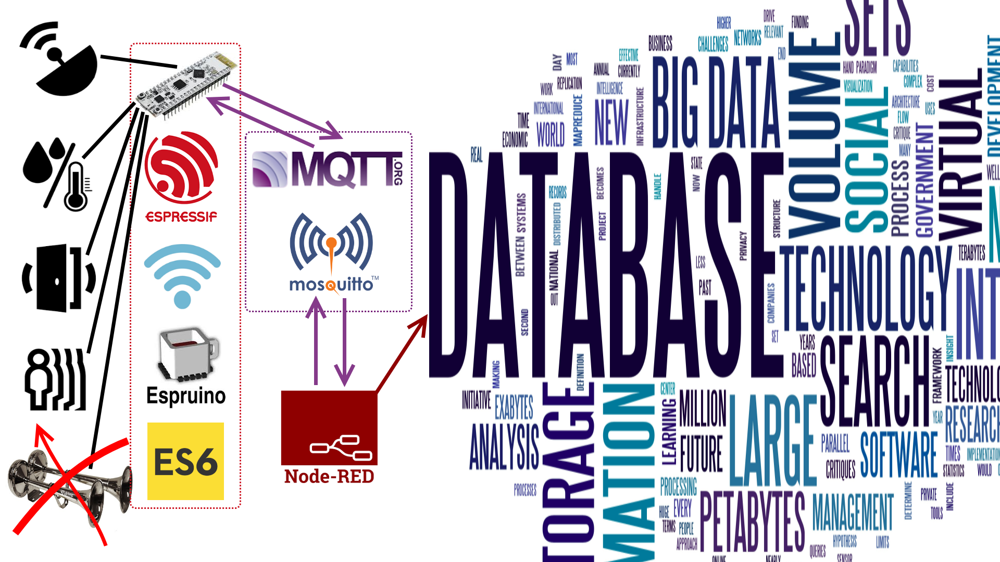

# INNOEXP v4 IoT

## Our Goal

*Make the lunch experience even more amazing than it already is.*

Before we know what to do we first need to measure stuff. We will create things with lots of sensors, whatever we come up with.

The things will see everything:

- Which door is opened or closed?
- How much activity is there around the salad bar?
- What’s the air quality around the toaster?
- ...and much more.

The  things are there to stay and they will gather tons of data. We can use it to analyze trends. ETL it. Use it for dashboards. Maybe for some AI to tell us what to do next…

## Getting started

### Sensors and actuators

The primary focus is on installing [sensors](https://en.wikipedia.org/wiki/Sensor) to gather information about the restaurant. We may also want to add an [actuator](https://en.wikipedia.org/wiki/Actuator) here and there. It should be OK, as long as we don't disturb people during their lunch break. Have a look at the descriptions of the available [sensors](./docs/Sensors.md) and [actuators](./docs/Actuators.md).

And again: `primary focus === sensors`!

#### Ideas

- Next to the components we already have we can tinker with existing electronic devices to use their sensors and actuators!
- We can also collect relevant data which is available on-line, like the weather data.

### Microcontrollers

The sensors and actuators will be connected to [microcontrollers](https://en.wikipedia.org/wiki/Microcontroller). We will use boards with [ESP8266](https://en.wikipedia.org/wiki/ESP8266) and [ESP32](https://en.wikipedia.org/wiki/ESP32) microchips from the company Espressif (https://www.espressif.com/). The main chip feature important for our project is built-in WiFi.

We will program the microcontrollers. There are many options to do that. Last year, during [INNOEXP v2](https://github.com/rovale/Innoexp2), we used the [Arduino programming language](https://www.arduino.cc/reference/en/) and the [Arduino IDE](https://www.arduino.cc/en/main/software). This year we need to be even more productive and we want to focus on the functionality. Therefore we will opt for a gentle decline: [Espruino](https://en.wikipedia.org/wiki/Espruino).

### Espruino

Espruino ([www.espruino.com](https://www.espruino.com/)) is an open source [JavaScript](https://en.wikipedia.org/wiki/JavaScript) interpreter for microcontrollers. It is designed for devices with small amounts of RAM. Espruino has dedicated boards, and it also runs on the [ESP8266](https://www.espruino.com/EspruinoESP8266) and [ESP32](https://www.espruino.com/ESP32). The web site contains a lot of documentation. The creator of Espruino, Gordon Williams, is also very helpful in the [forums](http://forum.espruino.com/). Although not every feature of the ESP32 is fully supported, for our goal Espruino seems to be a good fit. To get started with Espruino you first need to flash the Espruino firmware on the board. I already did this for most of our boards. When the firmware is in place, the Espruino Web IDE can connect to the board.

### Espruino Web IDE

The Espruino Web IDE can be installed from the [chrome web store](https://chrome.google.com/webstore/detail/espruino-web-ide/bleoifhkdalbjfbobjackfdifdneehpo). The first time we have to connect the board with the USB connector. Later, when we [connect the board to the WiFi](http://www.espruino.com/Reference#Wifi) network, we can remove the USB cable and we can program the board over WiFi.

### MQTT

[MQTT](https://en.wikipedia.org/wiki/MQTT) is the protocol of the Internet of Things. We will use it to publish `telemetry` and `status` data and to send `command`s.

Highlights of the MQTT protocol:

- Publish/Subscribe mechanism with a broker and multiple clients. Our microcontrollers will be clients.
- Publishers publish messages in topics. The topic name can contain slashes to organize it. Examples:
  - `evision/restaurant/thing-id1/status`
  - `evision/restaurant/thing-id1/telemetry/climate`
  - `evision/restaurant/thing-id1/telemetry/presence`

- Subscribers subscribe to topics. They can subscribe to specific topics, and they can use wildcards where `+` is a one level wildcard and `#` is a multiple level wildcard. Examples:
  - `evision/restaurant/#` - get all data (this is a lot!)
  - `evision/restaurant/thing-id1/telemetry/presence` - get the presence telemetry data from `thing-id1`.
  - `evision/restaurant/thing-id1/telemetry/#` - get all telemetry data from `thing-id1`.
  - `evision/restaurant/+/telemetry/#` - get all telemetry data
  
- The protocol has built in Quality of Service which provides a guarantee that messages are delivered.
  - QoS 0 - At most once.
  - QoS 1 - At least once.
  - QoS 2 - Exactly once.
- It is possible to publish retained messages. The broker will always keep that message and send it when a subscriber subscribes to the topic. We will use this for our status messages (`online`, `offline`).
- There is a Last Will and Testament feature. When a client is ungracefully disconnected from the server, then the broker will send this message. We will use this to publish the status `offline`.

The format of our messages is [JSON](https://en.wikipedia.org/wiki/JSON).

We will use the [Mosquitto](https://mosquitto.org/) MQTT broker and we will install it on a [Raspberry Pi](https://www.raspberrypi.org/).

### MQTTLens

MQTTLens can be installed from the [chrome web store](https://chrome.google.com/webstore/detail/mqttlens/hemojaaeigabkbcookmlgmdigohjobjm?hl=nl). It can connect to an MQTT broker and is able to subscribe and publish to MQTT topics. We can use it to test the behavior of our microcontrollers.

### Node-RED

We will use Node-RED to gather all our  data. As a bonus we can use it to display a dashboard.

### Data

This is what we will gather, the more, the better.

## Project

We will approach this as a real project. I already defined some [tasks](./docs/Tasks.md) and [stories](./docs/Stories.md). Who is going to be our PM?

## Technical notes

Although this is quite a technical project, I hope we can focus on functionality as much as possible. Here are some more [technical notes](./docs/Technical%20notes.md).
